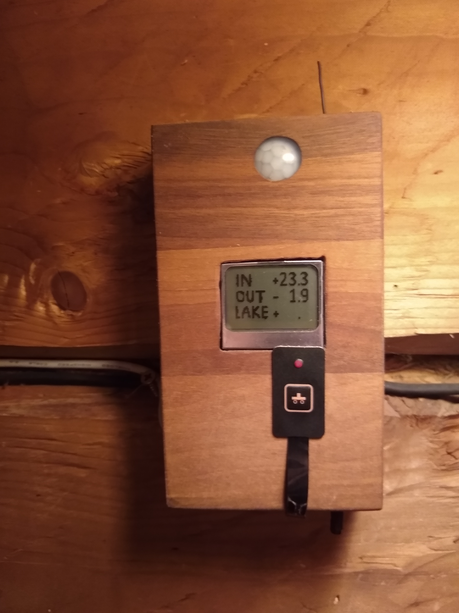

# Langaton näyttö lampotilaserverille

## Setup

- ATEMGA-328
- Nokia 5110 display
- DS18B20 lämpötilasensori
- yksi button
- Ciseco lähetin/vastaanotin
- Liiketunnustin 

## Toiminnallisuudet

- perustoimintana näyttää lämpötiloja jotka saa serverin kautta.
- mittaa sisalampotilaa, lähettaa datan serverille
- mittaa liiketta, lähettää datan serverille
- tulostaa radiolta tulevan datan soitettavista kappaleista
- voi ohjata muualla olevan lampotilaviisarin datan lähdettä (ulkona, sisällä, järvessä)

